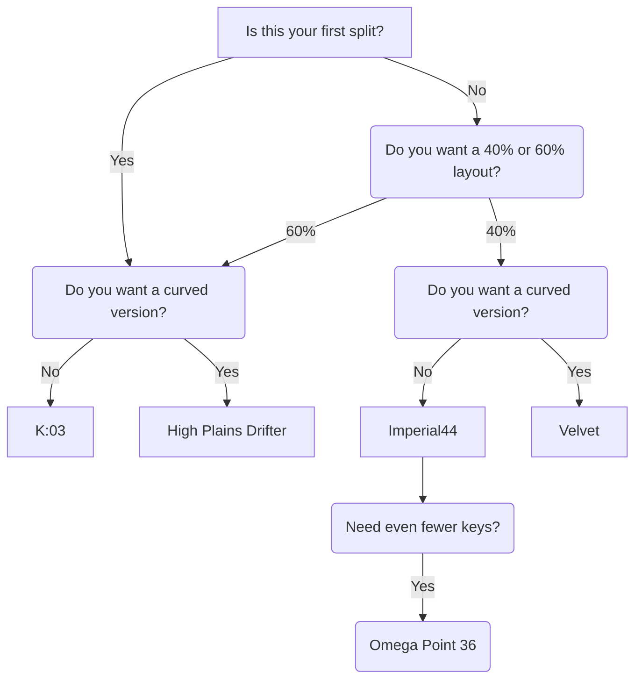

```mermaid
flowchart TD

    First[Is this your first split?] -- Yes --> Q3
    First -- No --> Second

    Second(Do you want a 40% or 60% layout?) -- 40% --> Q4(Do you want a curved version?)
    Second -- 60% --> Q3(Do you want a curved version?)

    Q3 -- No --> K03[K:03]
    Q3 -- Yes --> HPD[High Plains Drifter]

    Q4 -- No --> I44[Imperial44]
    Q4 -- Yes --> V[Velvet]

    I44 --> Q5(Need even fewer keys?)
    Q5 -- Yes --> OP36(Omega Point 36)
```
