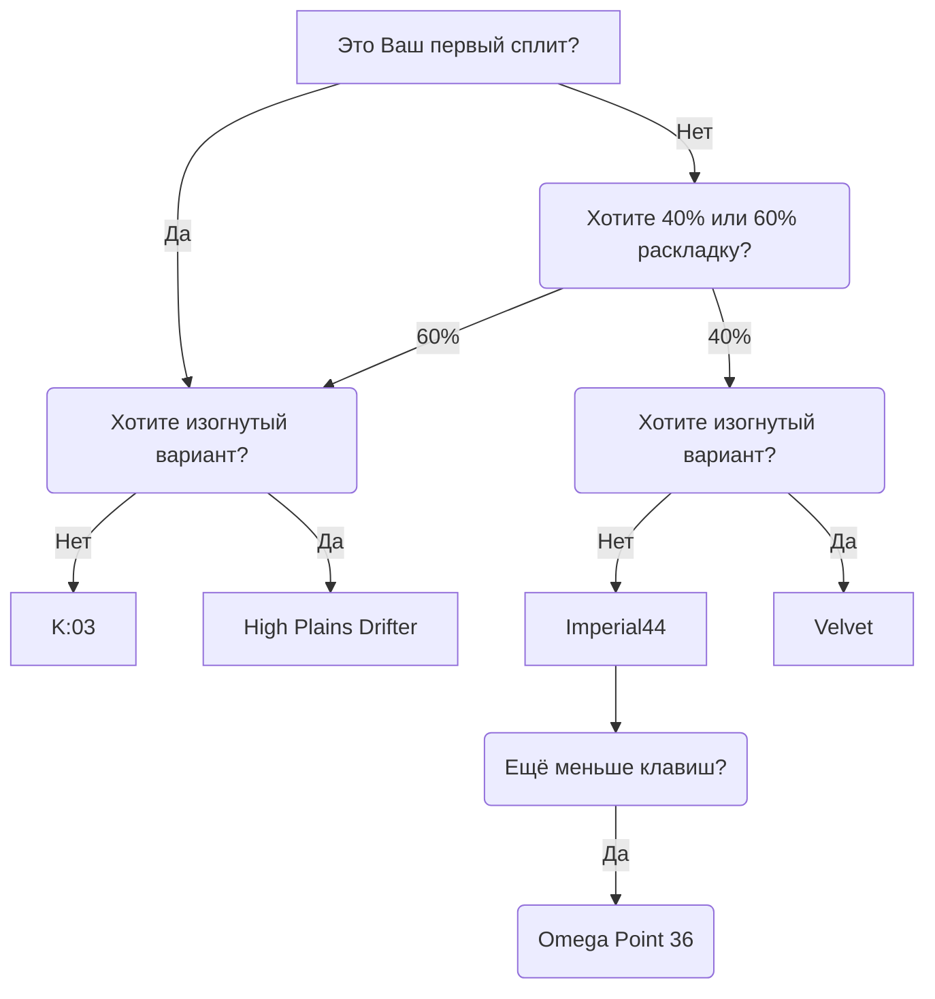

```mermaid
flowchart TD;

    First[Это Ваш первый сплит?] -- Да --> Q3
    First[Это Ваш первый сплит?] -- Нет --> Second

    Second(Хотите 40% или 60% раскладку?) -- 40% --> Q4(Хотите изогнутый вариант?)
    Second(Хотите 40% или 60% раскладку?) -- 60% --> Q3(Хотите изогнутый вариант?)

    Q3 -- Нет --> K03[K:03]
    Q3 -- Да --> HPD[High Plains Drifter]

    Q4 -- Нет --> I44[Imperial44]
    Q4 -- Да --> V[Velvet]

    I44[Imperial44]  --> Q5(Ещё меньше клавиш?) 
    Q5(Ещё меньше клавиш?) -- Да --> OP36(Omega Point 36) 


```
